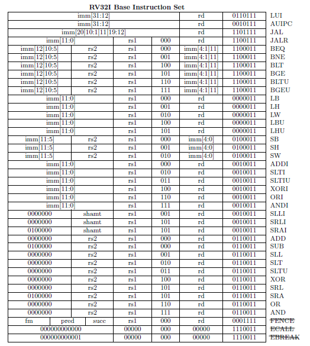

---
author:
- 浙江大学计算机体系结构实验
date: "DDL: 2023.10.19 23:59"
title: 实验1 - 流水线RISC-V CPU设计
---
# 实验1 - 流水线 RISC-V CPU 设计

DDL：2023.10.19 23:59

## 实验目的

-   温故流水线 CPU 设计

-   了解并实现 RV32I 指令集

-   理解旁路优化（Forwarding）

## 实验环境

-   **HDL**：Verilog、SystemVerilog

-   **IDE**：Vivado

-   **开发板**：NEXYS A7 (XC7A100T-1CSG324C) 或 Sword 4.0
    (XC7K325T-2FFG676)

## 实验原理

### 指令集概述

RISC-V是一种开源的精简指令集架构，采用模块化指令设计，它包含基础指令集和扩展指令集两部分。其中基础指令集是最小的指令子集，只要配上相应的特权态指令集，它就能够保证运行起一个操作系统。在完成基础指令集的基础上，开发者可以选择所需要的扩展指令集模块用以完成自己的需求，例如乘除法扩展指令集"M"，浮点指令集"F"等。

目前，最原始的基础指令集有 RV32I 和 RV64I 两种，分别代表32位地址空间和64位地址空间的基础指令集。本次实验中我们需要实现部分 RV32I 非特权指令集。

指令集具体请参考[官方手册](https://github.com/riscv/riscv-isa-manual/releases/download/Ratified-IMAFDQC/riscv-spec-20191213.pdf)。

### 实现指令
RV32I 非特权指令集指令布局如下图（源自官方手册）所示：

{.center}

本次实验需要实现前37条指令。

#### 整数运算指令（21 条）

**ADDI**

- **汇编格式**: ADDI rd, rs1, imm

- **功能定义**: 将寄存器 rs1 的值与**有符号扩展**至 32 位的立即数 imm 相加，结果写入寄存器 rd 中，忽略算术溢出。

**SLTI**

- **汇编格式**: SLTI rd, rs1, imm
- **功能定义**: 如果寄存器 rs1 的值(signed)小于**有符号扩展**至 32 位的立即数 imm，寄存器 rd 写入 1，否则写入 0。

**SLTIU**

- **汇编格式**: SLTIU rd, rs1, imm
- **功能定义**: 如果寄存器 rs1 的值(unsigned)小于**有符号扩展**至 32 位的立即数 imm(先符号扩展，然后再当成无符号数进行比较)，寄存器 rd 写入 1，否则写入 0。

**XORI**

- **汇编格式**: XORI rd, rs1, imm
- **功能定义**: 寄存器 rs1 的值(signed)和**有符号扩展**至 32 位的立即数 imm 按位异或，结果写入寄存器 rd 中。

**ORI**

- **汇编格式**: ORI rd, rs1, imm
- **功能定义**: 寄存器 rs1 的值(signed)和**有符号扩展**至 32 位的立即数 imm 按位或，结果写入寄存器 rd 中。

**ANDI**

- **汇编格式**: ANDI rd, rs1, imm
- **功能定义**: 寄存器 rs1 的值(signed)和**有符号扩展**至 32 位的立即数 imm 按位与，结果写入寄存器 rd中。


**SLLI**

- **汇编格式**: SLLI rd, rs1, shamt
- **功能定义**: 由立即数 shamt 指定移位量，对寄存器 rs1 的值进行逻辑左移，结果写入寄存器 rd 中。

**SRLI**

- **汇编格式**: SRLI rd, rs1, shamt
- **功能定义**: 由立即数 shamt 指定移位量，对寄存器 rs1 的值进行逻辑右移，结果写入寄存器 rd 中。

**SRAI**

- **汇编格式**: SRAI rd, rs1, shamt
- **功能定义**: 由立即数 shamt 指定移位量，对寄存器 rs1 的值进行算术右移，结果写入寄存器 rd 中。

**ADD**

- **汇编格式**: ADD rd, rs1, rs2
- **功能定义**: 将寄存器 rs1 的值和寄存器 rs2 的值相加，结果写入寄存器 rd 中，忽略溢出。

**SUB**

- **汇编格式**: SUB rd, rs1, rs2

- **功能定义**: 将寄存器 rs1 的值和寄存器 rs2 的值相减，结果写入寄存器 rd 中，忽略溢出。

**SLL**

- **汇编格式**: SLL rd, rs1, rs2

- **功能定义**: 将寄存器 rs1 的值逻辑左移寄存器 rs2 低 5 位所指定的移动量，结果写入寄存器 rd 中。


**SLT**

- **汇编格式**: SLT rd, rs1, rs2
- **功能定义**: 如果寄存器 rs1 的值(signed)小于寄存器 rs2 的值(signed)(注意是有符号比较)，寄存器 rd 写 1，否则写 0。

**SLTU**

- **汇编格式**: SLTU rd, rs1, rs2
- **功能定义**: 如果寄存器 rs1 的值(unsigned)小于寄存器 rs2 的值(unsigned)，寄存器 rd 写 1，否则写 0。

**XOR**

- **汇编格式**: XOR rd, rs1, rs2
- **功能定义**: 将寄存器 rs1 的值和寄存器 rs2 的值按位异或，结果写入寄存器 rd 中。

**SRL**

- **汇编格式**: SRL rd, rs1, rs2
- **功能定义**: 将寄存器 rs1 的值逻辑右移寄存器 rs2 低 5 位所指定的移动量，结果写入寄存器 rd 中。

**SRA**

- **汇编格式**: SRL rd, rs1, rs2
- **功能定义**: 将寄存器 rs1 的值算术右移寄存器 rs2 低 5 位所指定的移动量，结果写入寄存器 rd 中。

**OR**

- **汇编格式**: OR rd, rs1, rs2
- **功能定义**: 将寄存器 rs1 的值和寄存器 rs2 的值按位或，结果写入寄存器rd中。

**AND**

- **汇编格式**: AND rd, rs1, rs2
- **功能定义**: 将寄存器 rs1 的值和寄存器 rs2 的值按位与，结果写入寄存器 rd 中。


**LUI**

- **汇编格式**: LUI rd, imm
- **功能定义**:将 20 位立即数 imm 写入寄存器 rd 的高 20 位中，寄存器 rd 低 12 位置 0。

**AUIPC**

- **汇编格式**: AUIPC rd, imm
- **功能定义**: 将 20 位立即数后接 12 位 0 形成 32 位偏移量，再将偏移量与 AUIPC 指令所在的 PC 相加，结果写入寄存器 rd 中。

#### 跳转指令（8 条）

**JAL**

- **汇编格式**: JAL rd, offset
- **功能定义**: 将 jal 指令对应的 PC 加上 offset<<1（需要先左移一位。注意指令布局中该指令对应的立即数没有包含第 0 位，因为指令对齐的原因，目标指令相对当前指令的偏移末位一定为 0，所以没必要占位，从而扩大了该跳转指令的寻址范围） 的有符号扩展得到跳转的目标地址，然后把 jal 指令所在PC+4 写入寄存器 rd 中。

(PC_{next} = PC_{current} + (sign\_extend(offset) << 1), Reg[rd] = PC_{current} + 4)

**JALR**

- **汇编格式**: JALR, rd, offset(rs1)
- **功能定义**: 寄存器 rs1 的值加上有符号扩展的 offset 得到跳转的目标地址，并将目标地址最低位置 0（同样的，指令对齐问题），然后把 jalr 所在PC+4 写入寄存器 rd 中。

(PC_{next} = Reg[rs1] + sign\_extend(imm),PC_{next}[0] = 0, Reg[rd] = PC_{current} + 4)

**BEQ**

- **汇编格式**: BEQ rs1, rs2, offset
- **功能定义**: 如果寄存器 rs1 的值和寄存器 rs2 的值相等就发生跳转，跳转地址是有符号扩展$offset<<1$ 加上 BEQ 指令对应的 PC。

**BNE**

- **汇编格式**: BNE rs1, rs2, offset
- **功能定义**: 如果寄存器 rs1 的值和寄存器 rs2 的值不相等就发生跳转，否则顺序执行，跳转地址是有符号扩 offset<<1 加上 BNE 指令对应的 PC。

**BLT**

- **汇编格式**: BLT rs1, rs2, offset
- **功能定义**: 如果寄存器 rs1 的值(signed)小于寄存器 rs2 的值(signed)就发生跳转，否则顺序执行，跳转地址是有符号扩展 offset<<1 加上 BLT 指令对应的 PC。

**BLTU**

- **汇编格式**: BLTU rs1, rs2, offset
- **功能定义**: 如果寄存器 rs1 的值(unsigned)小于寄存器 rs2 的值(unsigned)就发生跳转，否则顺序执行，跳转地址是有符号扩展 imm<<1 加上 BLTU 指令对应的 PC。

**BGE**

- **汇编格式**: BGE rs1, rs2, offset
- **功能定义**: 如果寄存器 rs1 的值(signed)大于等于寄存器 rs2 的值(signed)就发生跳转，否则顺序执行，跳转地址是有符号扩展 offset<<1 加上 BGE 指令对应的 PC。

**BGEU**

- **汇编格式**: BGEU rs1, rs2, offset
- **功能定义**: 如果寄存器 rs1 的值(unsigned)大于等于寄存器 rs2 的值(unsigned)就发生跳转，否则顺序执行，跳转地址是有符号扩展 offset<<1 加上 BGEU 指令对应的 PC。

#### 访存指令（8 条）
**LB**


- **汇编格式**: LB rd, imm(rs1)
- **功能定义**: 寄存器 rs1 的值和有符号扩展的 imm 相加得到访存地址，根据访存地址从存储器中读取 8 位的值，将其进行有符号扩展为 32 位后写入寄存器 rd 中。

**LH**

- **汇编格式**: LH rd, imm(rs1)
- **功能定义**: 寄存器 rs1 的值和有符号扩展的 imm 相加得到访存地址，根据访存地址从存储器中读取 16 位的值，将其进行有符号扩展为 32 位后写入寄存器 rd 中。


**LW**

- **汇编格式**: LW rd, imm(rs1)
- **功能定义**: 寄存器 rs1 的值和有符号扩展的 imm 相加得到访存地址，根据访存地址从存储器中读取 32 位的值，写入寄存器 rd 中。

**LBU**

- **汇编格式**: LBU rd, imm(rs1)
- **功能定义**: 寄存器 rs1 的值和有符号扩展的 imm 相加得到访存地址，根据访存地址从存储器中读取 8 位的值，将其进行无符号扩展为 32 位后写入寄存器 rd 中。

**LHU**

- **汇编格式**: LHU rd, imm(rs1)
- **功能定义**: 寄存器 rs1 的值和有符号扩展的 imm 相加得到访存地址，根据访存地址从存储器中读取 16 位的值，将其进行无符号扩展为 32 位后写入寄存器 rd 中。


**SB**


- **汇编格式**: SB rs2, imm(rs1)
- **功能定义**: 寄存器 rs1 的值和有符号扩展的 imm 相加得到访存地址，根据访存地址将寄存器 rs2 的低 8 位的值写入存储器中。

**SH**

- **汇编格式**: SH rs2, imm(rs1)
- **功能定义**: 寄存器 rs1 的值和有符号扩展的 imm 相加得到访存地址，根据访存地址将寄存器 rs2 的低 16 位的值写入存储器中。

**SW**

- **汇编格式**: SW rs2, imm(rs1)
- **功能定义**:寄存器 rs1 的值和有符号扩展的 imm 相加得到访存地址，根据访存地址将寄存器 rs2 的 32 位的值写入存储器中。


### Forwarding

在流水线的运行过程中，data hazard 是拖累流水线效率的一个重要的因素。data hazard 本质上是读写同一个寄存器所导致的，所以检测 data hazard 只需对流水线中相应流水段中指令的寄存器编号进行比较，就可以判断 data hazard 是否发生。

```
add x1, x2, x3
add x4, x4, x1
```
以上示例中，不加干预，第二条指令在 EX 阶段会取到旧的 x1（第一条指令还没 WB）。我们可以检查 EX 和 ID 段的寄存器操作，如果前者的写目标寄存器和后者的源寄存器重合，说明存在 data hazard。

我们总是可以通过 stall 来解决 data hazard。
比如检测到如上的 data hazard 后，就保持 PC 以及 IF/ID，flush 掉 ID/EX 的寄存器两次（相当于插入两条 nop 指令，stall 两次）。

但是这影响流水性能，所以我们再通过 forwarding 来优化，减少 stall 的次数。
对于这个算术接着算术（add-add）的情况，在第二条指令 EX 阶段的时候，可以将处在 MEM 阶段的第一条指令已经计算出的 x1 前递给 EX 段，加上对应的源操作数选择器，就可以拿到这个正确的值，来避免 stall。

{.center}
<p style="text-align: center;">图1：EX 段 Forwarding 基本实现原理</p>

如图1所示，实现 forwarding
的基本功能需要在基本流水线的基础上添加两个模块以及相应的多路选择器：

-   Hazard detection unit: 控制 PC 和 IF/ID 流水线寄存器的写入以及 Nop
    的插入（stall）。

-   Forwarding unit: 通过比对流水段中的寄存器编号，控制 ALU
    前的多路选择器，以实现数据的替换。

这样就能够在数据写入 Register File 前，将最新的数据提供给 ALU。

图[1]是在把数据的 forwarding 放在了 EX 段，当然，也可以像图[2]一样把 forwarding 放到 ID 段，**具体选择哪一个流水段做 forwarding，大家可以根据流水段的时序情况做选择，选择时序压力小的一段做 forwarding 比较合适。**目前，两种 forwarding 都可以选择，不过实验给出的框架如图[2]，前递到 ID 段。

{.center}
<p style="text-align: center;">图2：ID 段 Forwarding 基本实现原理</p>

## 实验要求

1.  实现 RV32I 中的所有指令(除了 fence, ecall, ebreak)

2.  实现流水线中的 forwarding

3.  通过仿真测试和上板验证

## 实验步骤

1.  根据 RISC-V 非特权级手册完成部分 RV32I 指令集

2.  在流水线中加入 forwarding 机制

3.  在给定的 SOC 中，加入自己的 CPU，通过仿真测试和上板验证

## 注意事项

1.  在做 forwarding 的时候，请注意在图[1]的 5 级流水线架构下，存在相邻的 load 和一些需要 ALU 操作的指令发生数据冲突，需要额外 stall 一个周期的情况。例如 lw 后紧跟 add，如果存在数据冲突，就需要让 add 指令 stall 一个周期，等 lw 的数据传到 WB 段再 forward 到 EX 段（在 ID 段做 forwarding 则需要 stall 两个周期）。
    
2.  如果相邻的 load 和 store 要做 forwarding，需要增加额外的逻辑。如果没有做 forwarding，则需要 stall 一个周期。


## 思考题

1.  添加了 forwarding 机制后，是否观察到了 stall 延迟减少的情况？请在测试程序中给出 forwarding 机制起到实际作用的位置，并给出仿真图加以证明。
    
2.  有没有办法避免**注意事项**中提到的由 Load 所导致得需要额外 stall 一个周期或者两个周期这样的情况，即有没有办法做到只用 forwarding 解决 data hazard，不用额外的 stall 来解决 data hazard。如果有，请说明方法和利弊；如果没有，请说明理由。

**注：思考题写入实验报告内**
