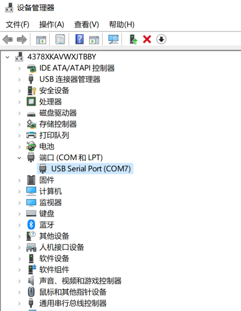
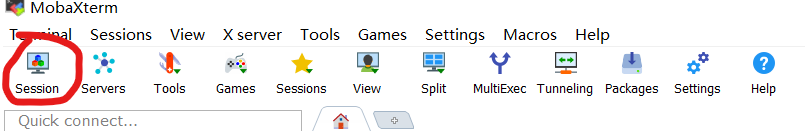
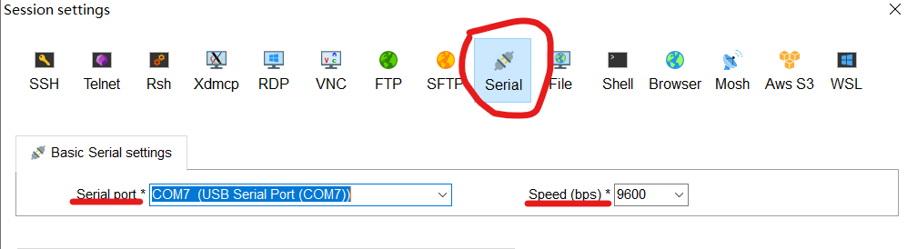
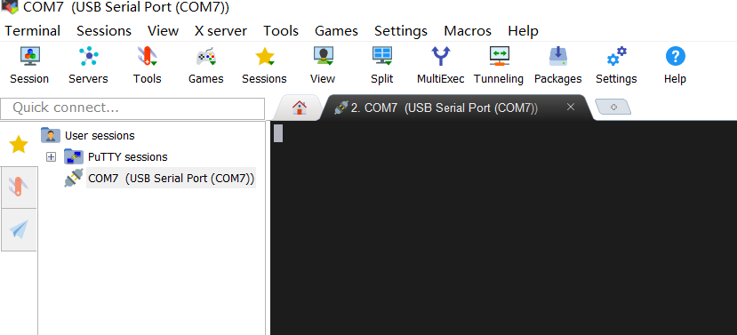
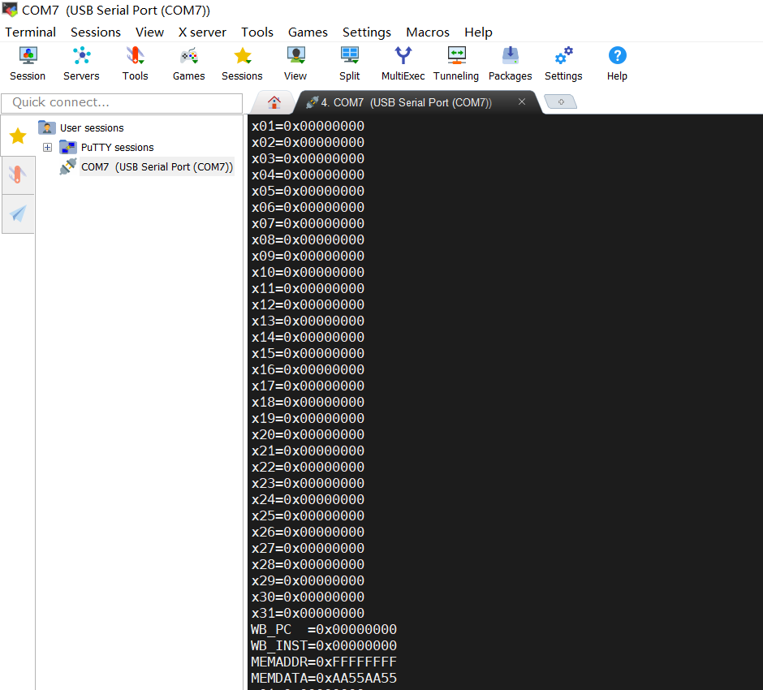

# NEXYS_A7 调试说明

本调试/展示功能仅适用于所给的 NEXYS A7 代码框架，如果同学们选择使用之前自己设计的CPU，可以参考
代码框架自行实现相关功能。

目前支持数码管和通过 UART 在个人电脑输出调试信息。为了便于个人调试和实验验收，建议使用后者。

## 数码管调试

开启单步调试：

- 将滑动开关SW0切至高电平，进入单步调试模式
- 点按BTNR，触发调试时钟，CPU运作单个周期，数码管将显示所选信号的值
  

调试信号类别选择：

- 若SW6为低电平，调试查看32个通用寄存器的值
- 若SW6为高电平，调试查看CPU内其他寄存器、控制信号的值，即RV32Core.v的Test_signal信号

调试具体编号的信号：

- 使用SW5-SW1这五个开关选择要调试的具体信号，对应 `code/auxillary/top.v` 中的`debug_addr`
  - 若查看通用寄存器，五个开关对应寄存器编号的二进制
  - 若查看其他信号，编号详⻅ `code/auxillary/CPUTEST.v`
## UART 
NEXYS A7 提供了 USB-UART 的桥接，这使得我们可以直接通过烧写bitstream的数据线让开发板和电脑通信。
### 修改工程
git pull 之后，你会发现 src/lab1 目录下多了 uart/。

请将其中的 `top.v` 替换原工程的 `code\auxillary\top.v`；将 `UART_TX_CTRL.vhd`、`uart_buffer.v`、`debug_ctrl.v`复制到你的工程的`code\auxillary\`下， `Add Sources`，将新的 `verilog` 模块加入到你的工程。需要指出，现在我们不需要 `VGA` 了，所以这部分可以去掉，节省从 `synthesis` 到上板子的时间:wink:。

然后，你需要修改你的`core/RV32core.v` :persevere:（一点点就行）

- 接口定义上，增加四条信号线
``` verilog
  module  RV32core(
        input debug_en,  // debug enable
        input debug_step,  // debug step clock
        input [6:0] debug_addr,  // debug address
        output[31:0] debug_data,  // debug data
        input clk,  // main clock
        input rst,  // synchronous reset 

        output[31:0] wb_pc,
        output[31:0] wb_inst,
        output[31:0] mem_addr,
        output[31:0] mem_data,
        
        input interrupter  // interrupt source, for future use
    );
```
- 找个地方放下面这段代码，来引出内部需要被观测的信号值
``` verilog
    assign wb_inst = inst_WB;
    assign wb_pc = PC_WB;
    assign mem_addr = MIO_MEM ? ALUout_MEM : 32'hFFFFFFFF ;
    assign mem_data = MIO_MEM ? Datain_MEM : 32'hAA55AA55 ;
```

如果你对给的代码框架看的比较仔细，你会看到`MIO_MEM`最初来自 `CtrlUnit.v`，用来表示是否为 `RAM` 访存操作。这里定义的四条引出信号为，WB 阶段的指令的 PC 值和内容；以及 MEM 阶段的访存地址和 RAM 的输出（即 RAM 中该地址的内容），如果 MEM 这部分执行的指令是一条访存指令。

最后，你需要为你的 `.xdc` 文件增加 uart 的引脚约束。复制下面的内容，粘贴到`constraint.xdc`文件最后面就行了 :kissing_heart:
```verilog
##USB-RS232 Interface
#set_property -dict { PACKAGE_PIN C4    IOSTANDARD LVCMOS33 } [get_ports { UART_TXD_IN }]; #IO_L7P_T1_AD6P_35 Sch=uart_txd_in
set_property -dict { PACKAGE_PIN D4    IOSTANDARD LVCMOS33 } [get_ports { UART_TXD }]; #IO_L11N_T1_SRCC_35 Sch=uart_rxd_out
#set_property -dict { PACKAGE_PIN D3    IOSTANDARD LVCMOS33 } [get_ports { UART_CTS }]; #IO_L12N_T1_MRCC_35 Sch=uart_cts
#set_property -dict { PACKAGE_PIN E5    IOSTANDARD LVCMOS33 } [get_ports { UART_RTS }]; #IO_L5N_T0_AD13N_35 Sch=uart_rts
```

### 建立通信
为了⽅便起⻅，我们使⽤ MobaXterm 这个终端⼯具。MobaXterm 可以在其[官网](https://mobaxterm.mobatek.net)免费下载。NEXYS A7 的 USB-UART Bridge 可参考[官方手册](https://digilent.com/reference/programmable-logic/nexys-a7/reference-manual)。
#### 确认连接
用数据线将开发板连接到电脑，查看计算机管理中的设备管理器的**端口（COM和LPT）**，可以发现对应的 USB Serial Port，记住端口号，下图为COM7。

#### 使用 MobaXterm 建立 Session
打开 MobaXterm，点击 Session 新建 Session

选择 Session 类型为 Serial，并且设置 Serial Port 为刚才在设备管理器中看到的 port 以及设置 Speed 为 9600bps。

会话成功建立。

### 调试说明
#### 单步调试

  - 将 SW0 切至高电平，进入单步调试模式
  - 将 SW8 切至高电平，使用 UART 调试
  - 点按BTNR（M17），触发调试时钟，CPU运作单个周期，MobaXterm 的窗口上会打印31个通用寄存器（X1-X31）的值，WB 阶段的 PC 和指令，以及 MEM 阶段的访存地址和 RAM 的数据输出。
  
#### 定制化输出信号值
  
  其实这和 VGA 显示有点类似，都是由相应的模块（计组的VGATEST，现在的 DEBUG_CTRL）采样 CPU 的信号（一个间隔取一个信号值），然后综合显示。 
  如果想要输出更多信号值（见 `code\auxillary\CPUTEST.v`），可以查看并修改 `debug_ctrl.v`。
