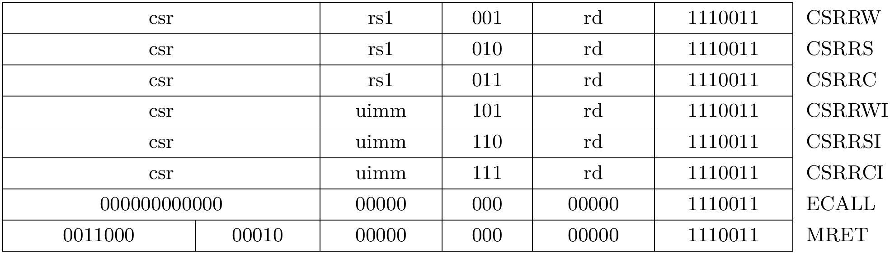
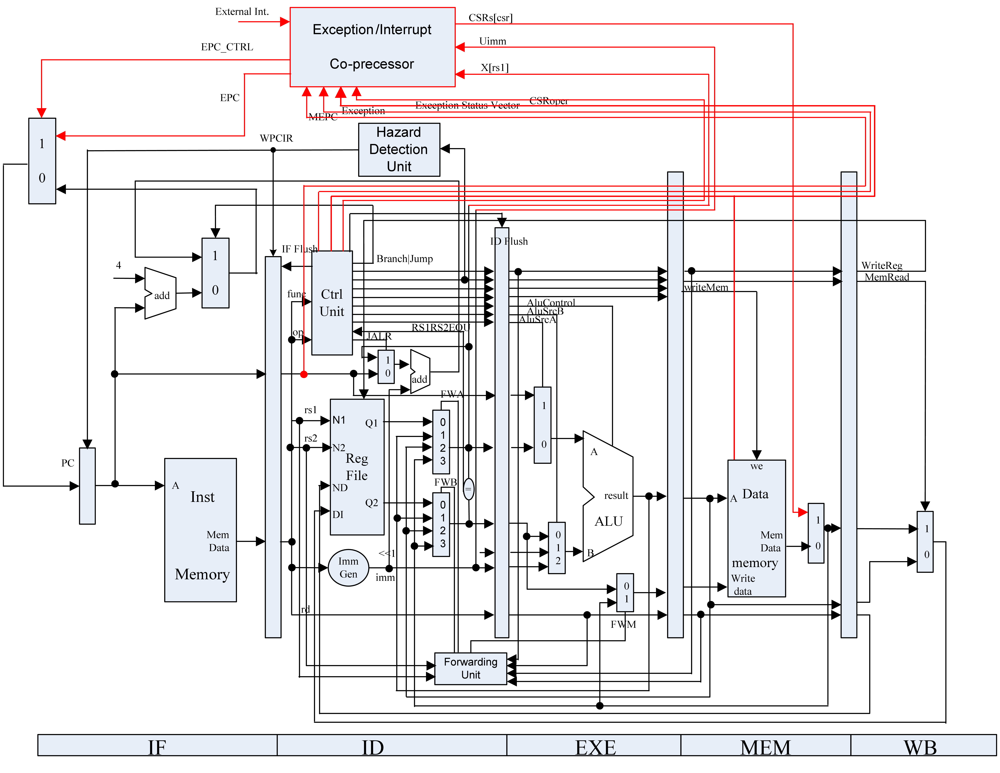

---
author:
- 浙江大学计算机体系结构实验
date: "DDL: 2023.11.9 23:59"
title: 实验2 - 流水线异常和中断设计
---

# 实验2 - 流水线异常和中断设计

DDL：2023.11.16 23:59

## 实验目的

-   了解RISC-V简单的异常和中断

-   了解如何在流水线中添加异常和中断机制

## 实验环境

-   **HDL**：Verilog、SystemVerilog

-   **IDE**：Vivado

-   **开发板**：NEXYS A7（XC7A100TCSG324）或 Sword 4.0（XC7K325TFFG676）

## 实验原理

### 特权级

RISC-V有三种特权级：M mode, S mode, U mode。设置不同的特权级可以用来管理系统资源的使用，提供软件的保护。其中，M mode的级别最高，是RISC-V硬件必须实现的，在M mode下跑的代码都被认为是安全可信的。U mode级别最低，在该模式下执行用户程序，对应于操作系统的用户态。S mode介于M和U之间，该模式下执行操作系统内核程序，对应于操作系统的内核态。**特权级的编码如表1所示**，本次实验仅考虑其中的M mode。

| Level | Encoding | Name             | Abbreviation |
| ----- | -------- | ---------------- | ------------ |
| 0     | 00       | User/Application | U            |
| 1     | 01       | Supervisor       | S            |
| 2     | 10       | *Reserved*       |              |
| 3     | 11       | Machine          | M            |

表1：RISCV privilege levels

### CSR

CSR（Control and Status Registers）是用来记录CPU中一些重要信息的寄存器，可以把它简单地看作特权寄存器。我们要实现的CSR有mstatus,  mtvec,  mepc,  mcause,   mtval。这些寄存器都属于前述的M mode，所以它们以字母m开头，只有M mode下可被访问。各CSR的定义、编号、权限等具体信息请参考[Privileged Spec](https://github.com/riscv/riscv-isa-manual/releases/download/Ratified-IMFDQC-and-Priv-v1.11/riscv-privileged-20190608.pdf)。

### 异常和中断

RISC-V手册中把异常（exception）定义为与某条指令关联的运行时发生的事件，把中断（interrupt）定义为会产生unexpected的控制流转移的外部异步事件。使用trap来指代exception或者interrupt。

我们需要实现的三种exception如下：

-   访问错误异常：当物理内存的地址不支持访问类型时发生，（例如尝试写入ROM）

-   环境调用异常：执行ecall指令时发生

-   非法指令异常：在译码阶段发现无效操作码时发生

发生异常/中断时，硬件自动经历如下的状态转换：

-   异常指令的PC被保存在mepc中，PC被设置为mtvec。对于异常，mepc指向导致异常的指令；对于中断，它指向中断处理后应该**恢复执行的位置**。

-   根据异常来源设置mcause，并将mtval设置为出错的地址或者其它适用于特定异常的信息字（本实验mtval的设置见注意事项部分）。

-   把控制状态寄存器mstatus中的MIE位置零以**禁用中断**，并把先前的MIE值保留到MPIE位中。

-   将发生异常之前的权限模式保留在mstatus的MPP域中，再把权限模式更改为M。

完成trap的处理后，软件通常执行mret以恢复至正常执行流，mret的主要操作有：

-   从mepc取值以恢复PC

-   更新权限模式，修改mstatus的MIE、MPIE、MPP等域

### 实现指令

需要实现的CSR相关指令如表2所示。具体的指令含义请参考[Unprivileged Spec](https://github.com/riscv/riscv-isa-manual/releases/download/Ratified-IMAFDQC/riscv-spec-20191213.pdf)和[Privileged Spec](https://github.com/riscv/riscv-isa-manual/releases/download/Ratified-IMFDQC-and-Priv-v1.11/riscv-privileged-20190608.pdf)。

表2：实现的指令

### 参考设计

图1：异常实现参考图

## 实验要求

1.  实现csrrw, csrrs, csrrc, csrrwi, csrrsi, csrrci, ecall, mret指令

2.  实现mstatus, mtvec, mepc, mcause, mtval寄存器

3.  实现“异常和中断”节中列出的三种异常和**外部中断**，需要实现精确异常

4.  通过仿真测试和上板验证

## 实验步骤

1.  根据RISC-V非特权级手册和特权级手册在流水线内加入异常和中断机制

2.  在给定的SoC中，加入自己的CPU，通过仿真测试和上板验证

## 注意事项

1.  本次实验仅需实现RISC-V的**M mode**，因此不必考虑对CSR的错误操作，例如越级的读写

2.  RISC-V没有明确指定存放CPU当前特权级的寄存器，所以你可以自行定义（虽然目前只有一个特权级）

3.  简单起见，处理异常时mtval的写入值可以只考虑两种情况

    -   访问错误异常时，写入错误的地址

    -   非法指令异常时，写入错误的指令

4.  本次实验主要在ExceptionUnit.v实现，但也需要注意其他模块：

    -   确定不同异常的触发位置，适当添加新的信号，以得到mtval需要的信息

    -   CSR的基本读写操作已经在CSRRegs.v实现，你可以直接使用这个模块，也可以修改它以在处理异常时更高效地实现CSR读取/修改

5.  目录lab2_ref提供了测试指令和数据的相关信息以及仿真结果的参考

    -   其中如csrr，csrw，csrs，csrc这样的指令为伪指令，不需要在硬件实现，其定义见RISC-V非特权手册的pseudoinstructions表

6.  上板前记得检查FPGA型号是否正确，小板子只要是xc7a100tcsg324都行

## 思考题

1.  精确异常和非精确异常的区别是什么？

2.  阅读测试代码，第一次导致trap的指令是哪条？trap之后的指令做了什么？如果实现了U mode，并以U mode从头开始执行测试指令，会出现什么新的异常？

3.  为什么异常要传到最后一段即WB段后，才送入异常处理模块？可不可以一旦在某一段流水线发现了异常就送入异常处理模块，如果可以请说明异常处理模块应该如何处理异常；如果不可以，请说明理由。
