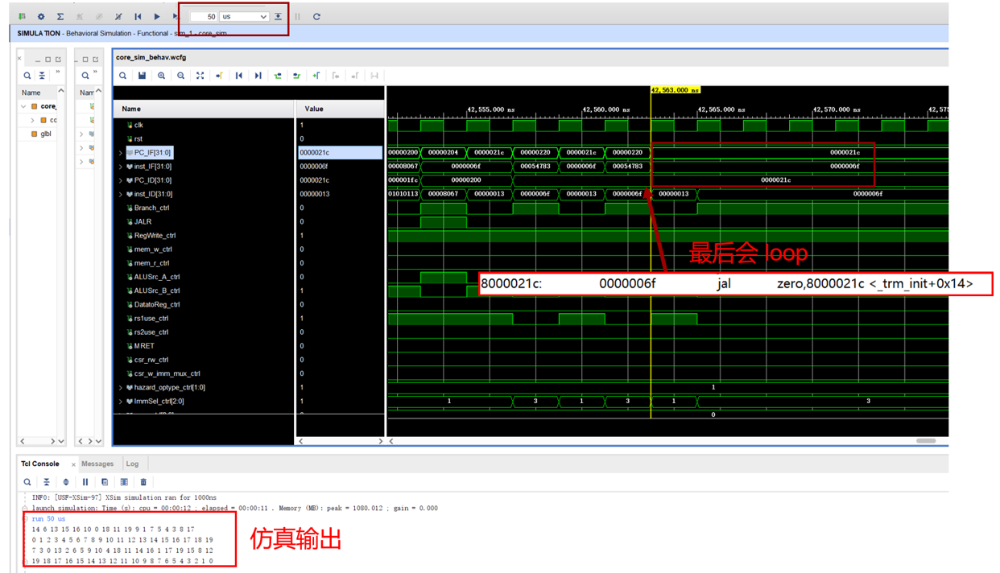

---
author:
- 浙江大学计算机体系结构实验
date: "DDL: 2023.12.7 23:59"
title: 实验3 - 动态分支预测
---
# 实验3 - 动态分支预测

DDL：2023.12.7 23:59

## 实验目的

-   了解分支预测原理

-   实现以 BHT 和 BTB 为基础的动态分支预测

## 实验环境

-   **HDL**：Verilog、SystemVerilog、Chisel

-   **IDE**：Vivado

-   **开发板**：NEXYS A7（XC7A100TCSG324）或 Sword 4.0（XC7K325TFFG676）

## 实验原理

### 动态分支预测

动态分支预测利用了运行时以往是否发生跳转的信息对未来的分支跳转进行预测。它会比 predict not taken 这样简单的静态分支预测要更加高效，准确率更高。本次实验需要大家实现 BHT 和 BTB 相结合的动态分支预测技术。

### BHT

branch-history table(BHT)，又名 branch-prediction buffer，它是一小块包含了跳转地址和历史跳转信息的 buffer。我们在遇到跳转指令的时候，通过对比之前保存在 buffer 中的跳转地址和相应的跳转信息来决定当前这条跳转指令是否应该发生跳转。buffer 基本信息如图1所示。
{.center}
<p style="text-align: center;">图1：BHT 概念图</p>


BHT的跳转地址可以是完整的指令地址，也可以是PC的低地址部分(也就是相当于做了一个 hash)。历史信息最简单的形式是用 1-bit 来表示当前分支跳转指令之前有没有发生跳转，如果历史分支跳转是 taken 的话，那么当前的分支跳转指令也选择跳转。反之亦然。当然，我们没有办法保证每次的分支预测都是正确的，如果遇到分支预测错误，需要重新 fetch 后面的指令，并修改 BHT 中的历史跳转信息。

本次实验我们会使用 2-bit 来表示历史跳转信息，从而提高预测的准确性。2-bit 的预测策略可以用一个状态机来表示，不过需要注意的是，这个状态机是保存在 BHT 中的每个表项中的，也就是说每一条分支跳转指令都会有一个 2-bit 的状态机来表示历史跳转信息。状态机如图2所示。

{.center}
<p style="text-align: center;">图2：2-bit prediction scheme</p>


BHT的数据结构有多种实现方式，包括链表，队列，哈希表等，大家选择自己喜欢的方式实现即可。

### BTB

看了BHT的基本介绍，大家可能会疑惑 BHT 中预测分支跳转是 taken 的情况下如何拿到跳转的目标 PC，BTB 就是来解决这一问题的。

branch-target buffer(BTB)，也叫 branch-target cache，用来保存预测的分支跳转目标地址。与 BHT 相结合，如果预测当前分支发生跳转，就根据当前的分支跳转指令的 PC，从 BTB 里拿到对应的目标跳转地址作为下一条指令地址。其基本结构就是一张 look-up
table，如图3所示。可以看到，表的左边记录的是访问过的分支指令的 PC，表的右边记录的是分支指令的目标地址。每次 BHT 预测当前分支是 taken 的情况下，通过查 BTB 来获取分支指令跳转的目标地址，从而不会有 stall 或者 flush。在更新 BTB 所维护的表的时候，要注意**每次记录的是 taken 的分支指令及对应的跳转目标地址**，如果分支指令不taken，也不需要记录，按顺序 fetch 下一条指令即可。


{.center}
<p style="text-align: center;">图3：BTB 结构</p>


在 5 段流水线中使用 BHT 和 BTB 进行分支预测的流程如图4所示。

{.center}
<p style="text-align: center;">图4：分支预测流程图</p>

## 实验要求

1.  实现用 BTB 和 BHT 做动态分支预测

2.  通过仿真测试和上板验证

3.  验收要求指出使用了 BTB 和 BHT 的跳转指令位置，展示 PC 的变化

4.  报告要求给出跳转预测成功和失败的分析

# 实验步骤

1.  在实现前递的 5 段流水线内增加 BTB 和 BHT

2.  在给定的 SOC 中，加入自己的 CPU，通过仿真测试和上板验证

# 注意事项

1.  本次实验基于实现前递的五级流水线，已经给出框架。你也可以使用自己实现的 lab1 或者 lab2，但是需要仿照给出的框架作出一些修改：替换 rom.hex 和 ram.hex；替换 ram.v，rom.v, uart_buffer.v 以及修改相应的调用；修改 rv32core 的接口，修改 top.v。

2.  测试程序的源码见 lab3_ref/src/sort.c，请阅读以明确程序的输出内容，反汇编代码见 lab3_ref/obj。

3.  本次实验的测试程序是一个**排序算法**，所以运算量非常大，单步调试较为繁琐。验收只会检查**排序结果**和若干条跳转指令：首先我们会看你的仿真跑到 loop 需要的时间相较不加分支预测是否有明显减少，然后直接在仿真图上检查若干跳转指令的预测情况；本次实验对串口显示作出了修改，当 SW[13] 拨上的时候，会传输测试程序打印的结果，即原数组和排序后的数组，上板不需要开单步调试，一次性打印完即可。
{.center}
    
    如果你发现你的结果不正确请不要慌张，可以试试下面的几个方法：

    -   首先请确保仿真的结果正确，仿真时会在 Tcl Console 显示程序的输出。因为测试比较复杂，需要多跑一段时间才能得到结果（可以设置为 50 微秒）。main 函数结束后会回到 _trm_init，进入一个空循环。如果你的仿真的 Tcl 输出打印了 error，说明排序错误。在 sort.c 中，一轮排序完，会调用 check 函数， 检查排序结果是否符合预期，如果相悖，就会打印 error，然后跳到 halt，在那里 loop。
    ```C
    for(i = 0; i < N; i++) {
		check(a[i] == i);
	}

    80000010 <check>:
    80000010:	00050463          	beq	a0,zero,80000018 <check+0x8>
    80000014:	00008067          	jalr	zero,0(ra)
    80000018:	80000537          	lui	a0,0x80000
    8000001c:	ff010113          	addi	sp,sp,-16
    80000020:	40050513          	addi	a0,a0,1024 # 80000400 <_end+0xffff7400>
    80000024:	00112623          	sw	ra,12(sp)
    80000028:	1f8000ef          	jal	ra,80000220 <puts>
    8000002c:	00100513          	addi	a0,zero,1
    80000030:	1d4000ef          	jal	ra,80000204 <halt>
    ```

    {.center}

    -   可以先用前两次实验的测试程序检测你的实现，看基本功能是否正确。

    -   你可以在测试程序源文件看到，测试程序通过 puti/puts 两个函数输出数组的元素。通过反汇编代码 ref/obj/sort-riscv32-cpu.txt 可以看到，这两个函数实际上会把要输出的字符写⼊地址 0x10000000。在 ram.v 中，会对写入地址进行判定，如果是 0x10000000，就会拉高 sim_uart_char_valid，并且将要写入的字符给 sim_uart_char_out，所以你可以在仿真中观测这些信号，或许有帮助。
    -   本次实验的测试指令序列非常长，出现 bug 以后较难定位从什么地方开始出错。你可以使用下述方式来快速定位出现问题的 PC。加分支预测和不加相比，就是在预测成功的时候，可以少掉 flush 一个周期的时间开销。将 is_flushed 的 cycle 去掉，两者的 PC 变化应当是一致的。
    ```verilog
    `timescale 1ns / 1ps

    module core_sim;
    reg clk, rst;
    wire [31:0] debug_WB_PC;
    // save pc at wb
    reg [31:0] wb_pc; 

    RV32core core(
        .debug_en(1'b0),
        .debug_step(1'b0),
        .debug_addr(7'b0),
        .debug_data(),
        .clk(clk),
        .rst(rst),
        .interrupter(1'b0),
        .wb_pc(debug_WB_PC) //add output here
    );
    
    integer traceout;
    initial begin
        // open trace file
        traceout = $fopen("trace.out");
        clk = 0;
        rst = 1;
        wb_pc = 0;
        #2 rst = 0;
    end

    always #1 clk = ~clk;
    
    always@(clk)begin
        if(wb_pc != debug_WB_PC)begin
            // output signal values to file
            $fdisplay(traceout, " WB_PC=0x%8h",debug_WB_PC );
            wb_pc <= debug_WB_PC;
        end
    end
    endmodule
    ```
    修改你的仿真代码，于是在仿真的时候，会记录 wb_pc 的值（连续相同的 wb_pc 只会保留一份），写到 .\Exp3_NEXYS_A7\Exp2.sim\sim_1\behav\xsim 目录下的 trace.out 文件。
    你可以先用不加分支预测的版本跑一遍仿真，得到一个 trace，再跑你的加了分支预测的版本，得到一个 trace，然后打开 vscode，对比两者的差异。
    {.center}
    {.center}


# 思考题  
1.  加了分支预测后，仿真跑测试程序，较没加的时候快了多少？

2.  在正确实现BTB和BHT的情况下，有没有可能会出现 BHT 预测分支发生跳转，也就是 branch
    taken，但是 BTB 中查不到目标跳转地址，为什么？

3.  前面介绍的 BHT 和 BTB 都是基于内容检索，即通过将当前PC和表中存储的PC比较来确定分支信息存储于哪一表项。这种设计很像一个全相联的 cache，硬件逻辑实际上会比较复杂，那么能否参考直接映射或组相联的 cache 来简化 BHT/BTB 的存储和检索逻辑？请**简述**你的思路。

**注：思考题写入实验报告内**
