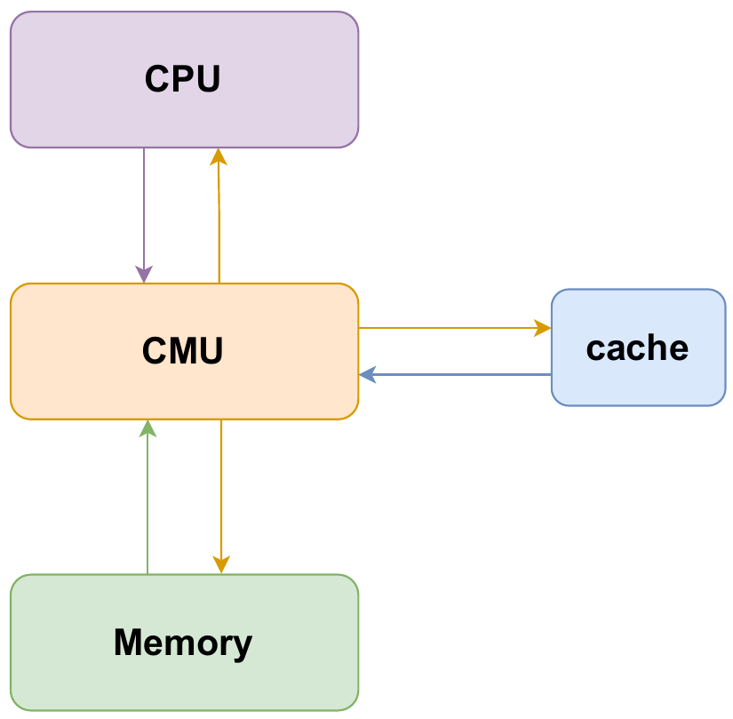
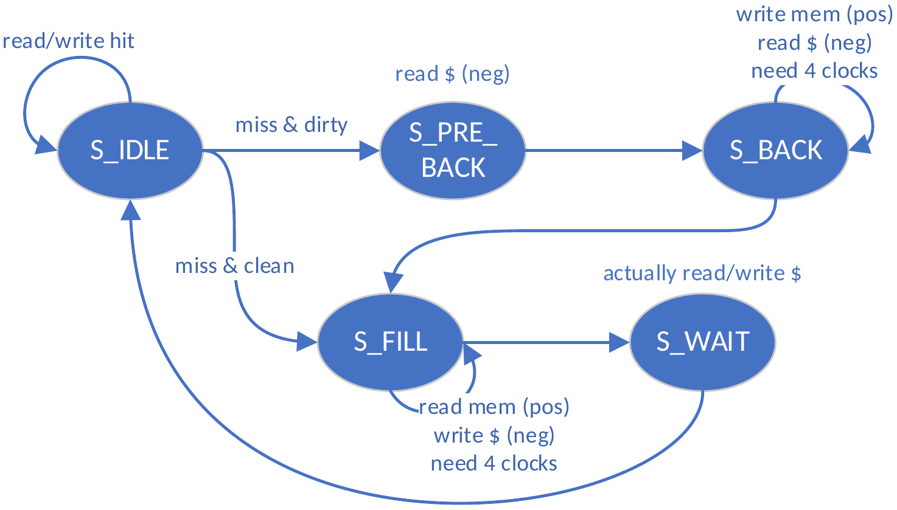
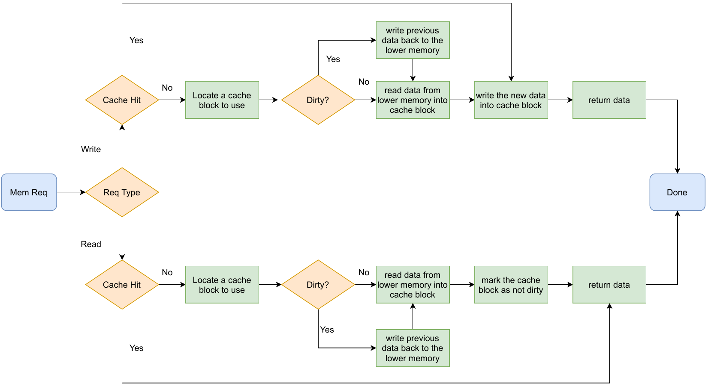
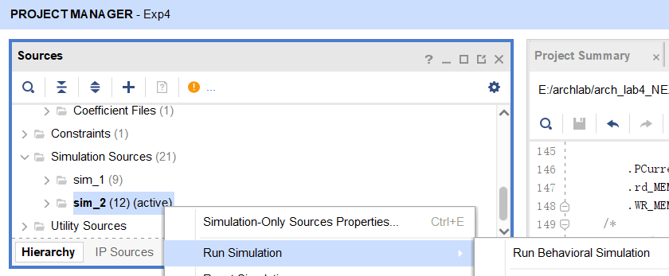

---
author:
- 浙江大学计算机体系结构实验
date: "DDL: 2023.12.14 23:59"
title: 实验4 - L1 cache设计
---

# 实验4 - L1 cache设计

DDL：2023.12.14 23:59

## 实验目的

-   了解cache在CPU中的作用

-   了解cache management unit(CMU)与cache和memory之间的交互机制

-   在CPU中集成cache

## 实验环境

-   **HDL**：Verilog

-   **IDE**：Vivado

-   **开发板**：NEXYS A7 (XC7A100T-1CSG324C) 或 Sword 4.0 (XC7K325T-2FFG676)

## 实验原理

### Cache

cache 作为 CPU 和内存之间的存储结构，能够利用其速度快、容量小的特点，在速度相差较大的两种硬件之间，起到协调两者数据传输速度差异的作用，是 CPU 存储层次中的重要组件。

本次实验要求cache实现**2路组相联**，采用**write-back,write-allocate**的数据更新策略，采用**LRU**的替换策略。这些内容相信在理论课上都已经有详细的描述，在此不再过多的展开。cache block如图1所示。此外，本次实验实现的Cache大小为1024B，每个块有16B，因此合计有1024/16/2=32个set。

| LRU  | V    | D    | Tag  | Data |
| ---- | ---- | ---- | ---- | ---- |

图1：cache block

### CMU

CMU实质上是把cache中的状态机部分和与CPU, Memory的交互部分独立出来，作为一个控制单元，控制数据的处理，为了方便CMU的控制，本次实验又把数据处理部分单独列了出来。CMU基本的架构与交互模式如图2所示，流水线如图5所示。

图2：架构

正如之前所述，CMU是一个专门的控制模块，用于控制数据的读写，对于其控制逻辑我们一般采用状态机的模式来管理，当然也是可以像CPU的datapath一样用流水线来实现CMU。下面图3给出了CMU的状态机。

图3：CMU状态机

CMU的状态机为5个状态，各个状态的功能为描述如下：

1.  S_IDLE: cache正常读写，即load/store命中或者未使用cache。

2.  S_PRE_BACK: 为了写回，先进行一次读cache

3.  S_BACK:上升沿将上个状态的数据写回到memory，下降沿从cache读下次需要写回的数据（因此最后一次读无意义），由计数器控制直到整个cache block全部写回。由于memory设置为4个周期完成读写操作，因此需要等待memory给出ack信号，才能进行状态的改变。

4.  S_FILL:上升沿从memory读取数据，下降沿向cache写入数据，由计数器控制直到整个cache block全部写入。与S_BACK类似，需要等待ack信号。

5.  S_WAIT: 执行之前由于miss而不能进行的cache操作。

上述状态要遵循的基本逻辑流程即为图4中展示的。总体来说，CMU处理的事务主要包括三件：读、写、替换。

图4：CMU读写事务流程

图5：datapath

## 实验要求

1.  cache和CMU要求采取write-back, write-allocate,LRU的策略

2.  通过仿真测试和上板验证

## 实验步骤

### 总体步骤

1.  理解所给代码框架的cache和CMU模块（不懂的地方问助教）

2.  补全cache和CMU模块的代码

3.  在给定的SoC中，加入自己的CPU，通过仿真测试和上板验证

### 仿真验证

1. 本次实验有两个仿真，一个仅用于仿真CMU和Cache模块，对应于code/cache/sim/sim_top.v；另一个用于仿真完整的CPU，对应于code/sim/core_sim.v。

2. 前者会仿真一些访存操作，后者则和以往一样，运行简单的测试程序。

3. CPU的测试仅有18条指令，所以请仔细核对以确保结果正确。

4. 推荐先对模块仿真，然后再对整体仿真。

5. 若仿真CMU和Cache模块，在Sources中的Simulation Sources目录中右键sim_1选择运行仿真；若仿真完整CPU，则在sim_2上右键运行仿真。

   {width="60%"}

6. 如果想先熟悉下正确的测试结果，可以先把Cache去掉，使用旧版内存，具体操作为：将RV32Core的CMU和RAM注释掉，同时把下方"RAM_B data_ram \..." 的注释打开，最后把cmu_stall置为0（**重新使用Cache时记得恢复**）。

### 上板验证

在单步调试模式可以查看寄存器值、WB 阶段的 PC 和指令，以及访存的地址和结果。

## 注意事项

1.  CMU&Cache模块仿真参考结果见目录ref/sim_ref

2.  CPU测试程序及内存数据的介绍见目录ref/

## 思考题

1.  在实验报告分别展示缓存命中、不命中的波形，分析时延差异。

2.  在本次实验中，cache采取的是2路组相联，在实现LRU替换的时候，每一个set需要用多少bit来用于真正的LRU替换实现？

3.  如果要实现cache的4路组相联，请描述一种真LRU和一种Pseudo-LRU的实现方式，并给出实现过程中每一个set需要用到多少bit来实现LRU。关于Pseudo-LRU，实现方式可以在网上查阅。

**注：思考题写入实验报告内**
