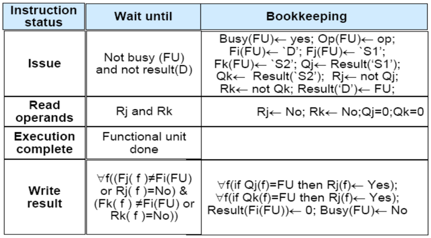
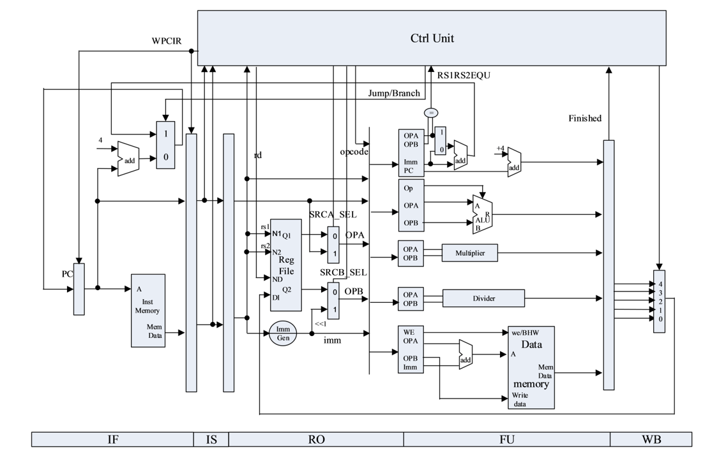
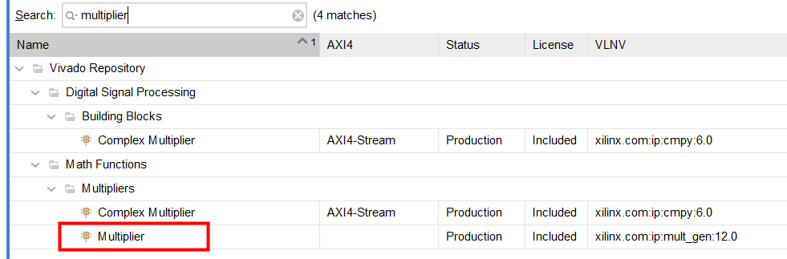
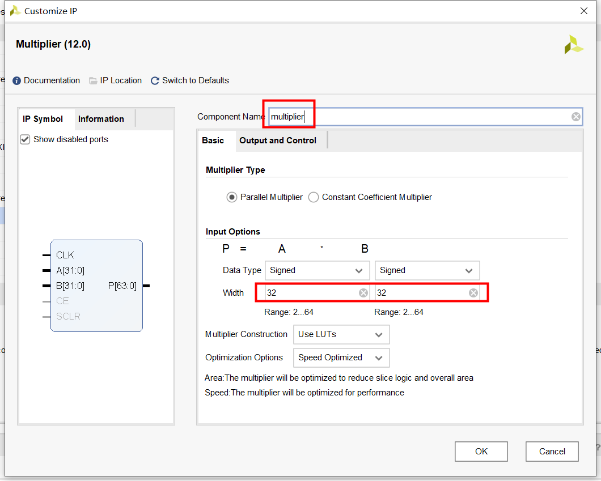
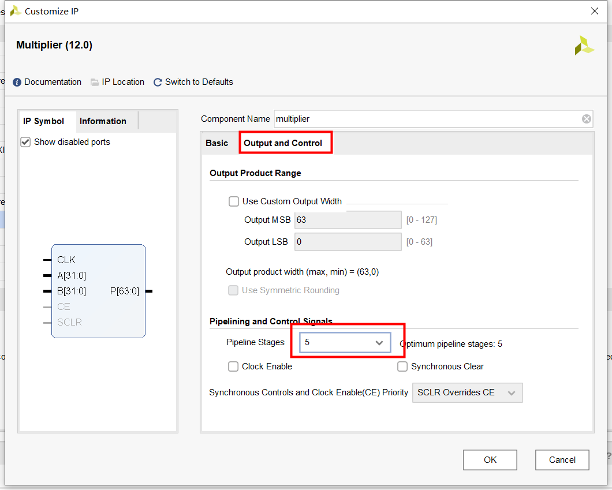
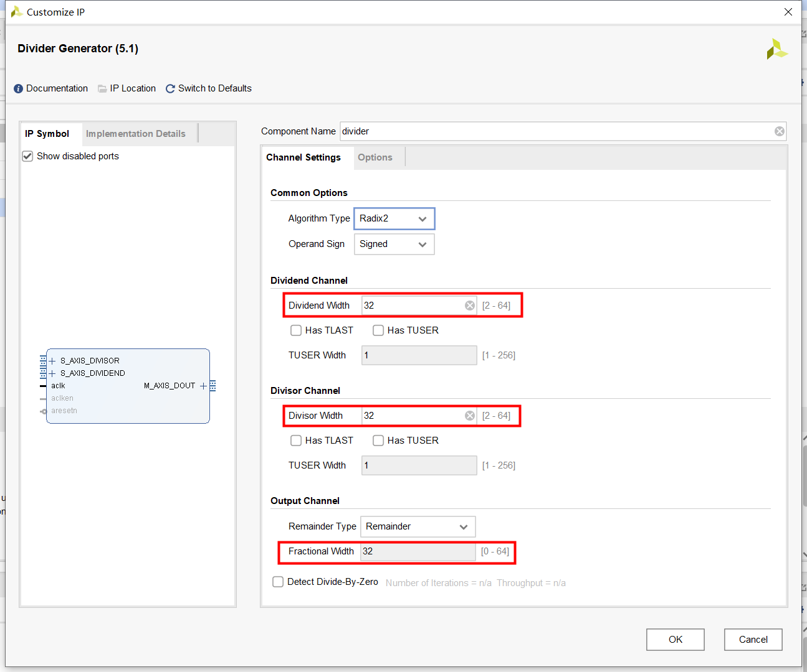
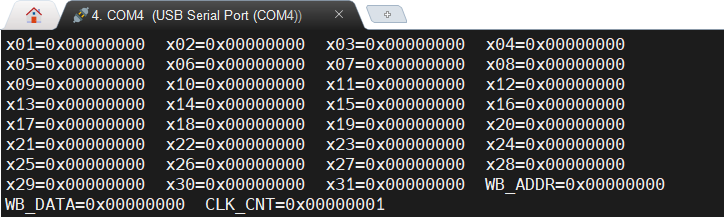

---
author:
- Computer Architecture Experiment of ZheJiang University
date: "DDL: 2022.12.28 23:59"
title: Lab 5 Out-of-order Pipeline Design with Scoreboard
---
# Lab5 - Out-of-order Pipeline Design with Scoreboard
DDL: 2022.12.28 23:59

## Experiment Purpose

-   Understand the algorithm of Scoreboard

-   Understand out-of-order execution of processor

-   Implement the pipeline with out-of-order execution of multi-cycle
    operation

## Experiment Environment

-   **HDL**: Verilog

-   **IDE**: Vivado

-   **Board**: NEXYS A7 (XC7A100T-1CSG324C) or Sword 4.0
    (XC7K325T-2FFG676)

## Experiment Methodology

### Scoreboard

The algorithm of scoreboard could be applied to the pipeline intend for
out-of-order execution of the instructions, which is a effective way to
improve the CPI of processor. We can divide the pipeline using
scoreboard into 5 stages.

1.  **Instruction Fetch:** Fetch instructions from memory.

2.  **Issue:** If a functional unit for the instruction is free and no
    other active instruction has the same destination register, the
    scoreboard issues the instruction to the functional unit and updates
    its internal data structure. This step replaces a portion of the ID
    step in the in-order pipeline. By ensuring that no other active
    functional unit wants to write its result into the destination
    register, we guarantee that WAW hazards cannot be present. If a
    structural or WAW hazard exists, then the instruction issue stalls,
    and no further instructions will issue until these hazards are
    cleared. When the issue stage stalls, it causes the buffer between
    instruction fetch and issue to fill; if the buffer is a single
    entry, instruction fetch stalls immediately. If the buffer is a
    queue with multiple instructions, it stalls when the queue fills.

3.  **Read Operands:** The scoreboard monitors the availability of the
    source operands. A source operand is available if no earlier issued
    active instruction is going to write it. When the source operands
    are available, the scoreboard tells the functional unit to proceed
    to read the operands from the registers and begin execution. The
    scoreboard resolves RAW hazards dynamically in this step, and
    instructions may be sent into execution out of order. This step,
    together with issue, completes the function of the ID step in the
    simple in-order pipeline.

4.  **Execution:** The functional unit begins execution upon receiving
    operands. When the result is ready, it notifies the scoreboard that
    it has completed execution. This step replaces the EX step in the
    in-order pipeline and takes multiple cycles in the pipeline.

5.  **Write Back:** Once the scoreboard is aware that the functional
    unit has completed execution, the scoreboard checks for WAR hazards
    and stalls the completing instruction, if necessary. In general,
    then, a completing instruction cannot be allowed to write its
    results when:

    -   There is an instruction that has not read its operands that
        precedes (i.e., in order of issue) the completing instruction,
        **and**

    -   One of the operands is the same register as the result of the
        completing instruction.

    If this WAR hazard does not exist, or when it clears, the scoreboard
    tells the functional unit to store its result to the destination
    register. This step replaces the WB step in the simple in-order
    pipeline.

Here comes the formal description of scoreboard algorithm:

## Pipeline

The datapath is illustrated below

## Experiment Task

1.  Implement the algorithm of scoreboard, and incorporate it into
    pipeline.

2.  Pass the simulation test and fpga verification.

## Experiment Procedure

1.  To avoid compatibility issues, you need to generate two IPs by
    yourself.

    -   We need a divider and a multiplier in this lab

    -   First, open the "IP Catalog" from the left navigation bar

    -   Then, search "multiplier" and select the **"Multiplier"** from
        "Math Functions" 

         

  
        

    -   Customize "Basic" as follows 

        

    -   Customize "Output and Control" as follows
        

     

    -   Remember to set the **Component Name** as "multiplier"

    -   Finally, search "divider" and select the **"Divider Generator"**
        from "Math Functions"
         

        

    -   Customize "Channel Settings" as follows

       

    -   Remember to set the **Component Name** as "divider"

2.  Complete the scoreboard in the given framework, i.e. fill the code
    in **CtrlUnit.v**.

3.  Integrate your CPU into SOC, and pass the simulation test and fpga
    verification.

4.  Here, WB\_ADDR refers to the register to
    be updated at WB stage, WB\_DATA refers to the value that will be
    written to it.

    
    

# Note

1.  Descriptions of instructions and data to be test can be found in
    "ref" directory

2.  You can refer to "ref/sim\_ref" directory for simulation results

3.  If your vivado fails to identify the new added IPs, try restarting

4.  Macros in CtrlUnit.v can be found in CtrlDefine.vh

5.  Since only one register can be written per beat, you need to pay
    attention to the case that multiple functional units complete
    execution at the same time

# Questions

1.  Why doesn’t scoreboard use forwarding?

2.  If we use a branch predictor, can we just let the CPU execute the
    predicted instructions? What if the prediction is wrong?

3.  Point out where the out-of-order occurs based on simulation
    waveform.

4.  Analyze the pros and cons of scoreboard.

**Note: Write your answer in your lab report!**
