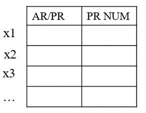
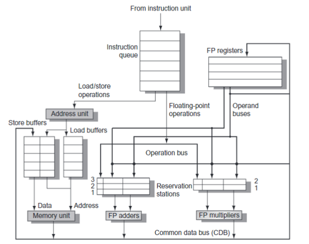
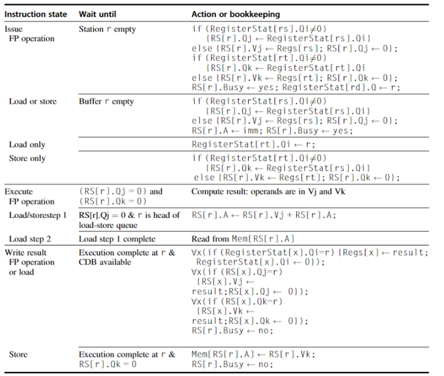

---
author:
- 浙江大学计算机体系结构实验
date: "DDL: --"
title: 实验6 - Tomasulo 乱序执行
---

# 实验6 - Tomasulo 乱序执行

DDL：--

## 实验目的

-   理解寄存器重命名的作用

-   理解 Tomasulo 算法

-   实现简单（符合课本 Tomasulo 描述）的乱序处理器

## 实验环境

-   **HDL**：Verilog

-   **IDE**：Vivado

-   **开发板**：NEXYS A7 (XC7A100T-1CSG324C) 或 Sword 4.0 (XC7K325T-2FFG676)

## 实验原理

### 寄存器重命名

回顾一下，指令执行过程存在很多相关性：
   
**数据相关性**
   
   -  Read After Write，RAW 相关性，表示一条指令的源寄存器来自于它前面的某条指令计算的结果。 
   
   -  Write After Write，WAW 相关性，表示两条指令都将结果写到同一个目的寄存器中，前一条指令的写可能覆盖了后一条的写。
   
   -  Write After Read，WAR 相关性，表示一条指令的目的寄存器和它前面的某条指令的源寄存器是一样的，后一条指令的写可能先于前一条指令的读。

**控制相关性**

由于分支指令而引起的相关性

**结构相关性**

指令必须等到处理器当中某些部件（Structure）空闲的时候才可以继续执行，例如功能单元（FU）

我们在这里关注数据相关性的解决：

- 在顺序流水线中，只有 RAW 会出现，我们可以 stall，也可以 forwarding。
- 基于 scoreboard 的乱序流水线，出现了 WAW 和 WAR，scoreboard 的做法是都等待。对于 WAW，IS 段指令在检测到后续流水中存在写相同寄存器的指令时，会卡住；对于 WAR，WB 段指令发现 RO 段存在指令的操作数和它要写入的寄存器匹配时（并且相应 ready = yes，就绪了就别去覆盖了），会卡住。
- 基于 tomasulo 的乱序流水线，使用寄存器重命名的方式消除了 WAW 和 WAR。

什么是寄存器重命名？
   ``` asm
   fadd.d  f6,f0,f8
   fsub.d  f8,f10,f14
   fadd.d  f7,f0,f8
   ```
   这样前两条指令存在 WAR
   ``` asm
   fadd.d  f6,f0,S
   fsub.d  T,f10,f14
   fadd.d  f7,f0,T
   ```
   寄存器换名将第一条指令的源指向另外的物理寄存器S，就不会覆盖了。第二条指令的结果记为了 T（区别于 ISA 定义的 f8 的另外的寄存器），第三条指令的 f8 也被重定向到了 T。

实现寄存器重命名需要:

- 区别于 ISA 定义的 AR（architecture register）的一组 PR（physical register），用来换名。

- RAT（register alias table），记录 AR 到 PR 的映射关系（AR 有没有被换名，以及最新对应于哪一个 PR）。
   
   {width="40%"}
### Tomasulo 算法


这是结构图。

- 不同于 scoreboard，这里在功能单元前多了一个叫做保留站（RS， reservation station）的结构，负责缓存等待操作数就绪、从而可以发射到功能单元的指令。相信大家都清楚，在指令放到保留站的时候，操作数如果还未在 regsfile 就绪，就会指向某个保留站，所以这里的保留站其实就起到了 PR 的作用；我们还需要一张表（RegisterStat）帮助确定指向哪一个保留站，这就是 RAT。

- 访存操作可以设置专门的 load/store buffer。

- 另外，功能单元执行完毕以后，结果不再是先存到 regsfile 再给到等待这个的结果的指令们，而是放到 CDB（common data bus），广播到 regsfile、等待它的保留站以及 load/store buffer。

这是算法描述。以下做一点解释：
另，保留站有 op Qj Qk Vj Vk A busy 这些域; RAT 的 Qi 指向 RS，可以规定 0 表示直接用 regsfile，或者再加一个域。

- 发射阶段

   检查一下结构冒险（RS 是不是有空的表项）。如果有的话，请求分配一个 r 来用。
   
   对于 FP 操作，检查 RAT，如果 Qi 不为 0，就将 RS[r].Qj 指向它（某个保留站）；否则直接从 regsfile 取值到 RS[r].Vj。另外一个操作数同理。同时还需要更新一下 RAT。

   对于 load、store 操作，先同理写 RS[r].Qj、RS[r].Vj（访存地址基址），这里还要写 A（访存地址偏移）。对于 load 操作，还需要更新 RAT；对于 store 操作，还需要写 RS[r].Qk、RS[r].Vk（将要被写入 ram 的操作数）。

- 执行阶段

   对于 FP，就绪就可以送入功能单元执行。**（其实这里，如果保留站出现多条操作数就绪的指令，你需要考虑采取什么样的策略来选哪一个先执行）**

   对于 load/store，需要计算访存地址更新 A；load 还需要从 ram 读取值。**（本次实验不需要实现乱序访存，你可以定义，只有当访存指令之前的 store 都完成了才执行这个访存指令；或者干脆所有的访存指令都还是顺序完成；或者 RS 只开一个表项，通过结构竞争来保证顺序访存）**

- 写回阶段

   对于 FP 以及 load 操作，CDB 空闲就可以广播（**registers、RAT的更新；各个保留站等待操作数的更新**）；同时释放所占的 RS。

   对于 store，需要等待写到 ram 的值，然后写入 ram，释放所占的 RS。

   **你需要注意，可能存在多个功能单元同时完成执行，要求占用 CDB；你需要实现一个仲裁逻辑，可以类似于 lab5，通过 if-else 选择一个优先执行，延迟其他的广播。**


## 实验要求

1. 理解并且实现课本描述的 tomasulo 算法
2. 合格标准为实现寄存器换名、可以消除 WAR/WAW(**+6**)（你可以通过 lab5 的测试指令测试）。我们给出了一些接口，你可以参考。

3.  减轻同学们的工作量，你可以
对于跳转指令，stall
对于访存指令，stall 或者 RS 只开一个 entry（通过结构竞争保证顺序访存）


4.  你可以继续实现(**2+4\*3**)
      Load store queue
      RS 里面，操作数同时就绪的指令的选取策略（先发射的先执行）
      ROB
      乱序访存

      

## 思考题

1. 处理器设计中，我们也可能用到基础的数据结构，比如 ROB 和 ISQ 本质都是 Queue。
(a) 列出至少 1 个处理器可能用到的硬件 Stack。
(b) 解释为什么 RS 不能是 Queue 而 ROB 一定要是 Queue。
2. 如何使用乱序访存来提高 IPC？


**注：思考题写入实验报告内**
